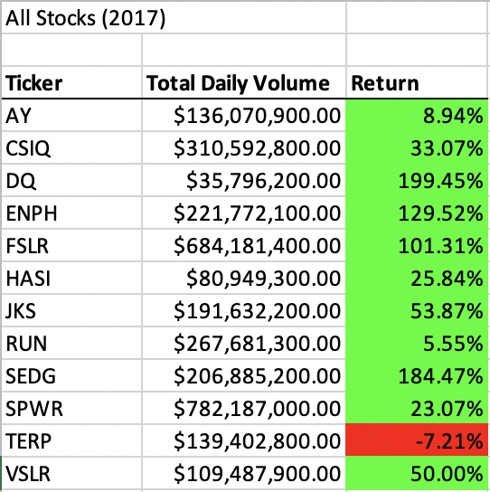
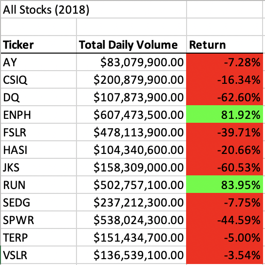

# VBA of Wall Street: Stock Analysis

## Overview of Project

### Purpose
The purpose of this project is to help Steve create a stock analysis tool that he can use to analyze stock performances and provide investment recommendations to his clients. To complete this task, I have analyzed sets of stock data for two different years using VBA code within the developer extension of Excel. Steve is now able to use the macros I wrote to run a stock analysis with the click of a button, and can then analyze the data to help his first client, his parents, make valuable and insightful investments.

## Results

### VBA Analysis
To perform this stock analysis, I used VBA in Excel to iterate through all the rows of the stock data, depending on the year specified by the user. To calculate total daily volume and return for each stock, I used for loops and conditionals (if/else statements) to get each total volume, starting price, and ending price. In the refactored code, this was done using different arrays where each stock had a corresponding index. The for loop used to do this analysis is shown below:  
    
    For i = 2 To RowCount

        tickerVolumes(tickerIndex) = tickerVolumes(tickerIndex) + Cells(i, 8).Value
        
        If Cells(i, 1).Value = tickers(tickerIndex) And Cells(i - 1, 1).Value <> tickers(tickerIndex) Then
        
            tickerStartingPrices(tickerIndex) = Cells(i, 6).Value

        End If
       
        If Cells(i, 1).Value = tickers(tickerIndex) And Cells(i + 1, 1).Value <> tickers(tickerIndex) Then
        
            tickerEndingPrices(tickerIndex) = Cells(i, 6).Value
            tickerIndex = tickerIndex + 1

        End If
    
    Next i

### Analyzing Stock Performance in 2017
In 2017, all analyzed stocks had positive returns except TERP, which had a return of -7.21%. The stocks that generated the highest returns this year were DQ, ENPH, and SEDG. The full analysis is shown below, visualizing the total daily volume and returns for each stock. 

### Analyzing Stock Performance in 2018
In 2018, most stocks in the analysis did not perform as well. Only ENPH and RUN generated positive returns, and the remainder of the stocks dropped dramatically. While DQ performed exceptionally well in 2017, fueling Steve's parents' initial investment decision, it plummeted in 2018 and would no longer be the best investment choice. The full results are shown below.

### Recommendation for Steve's Parents
which stocks to invest in..

## Summary

### Refactoring Code in General
advantages and disadvantages 

### Refactoring the Stock Analysis VBA Script
advantages and disadvantages
