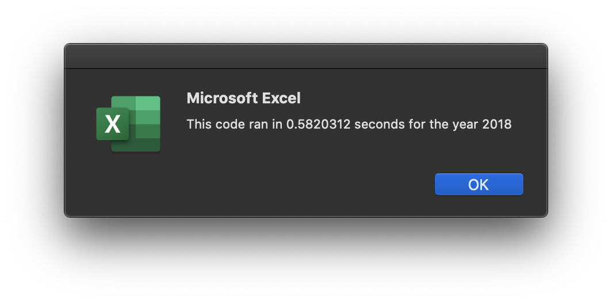
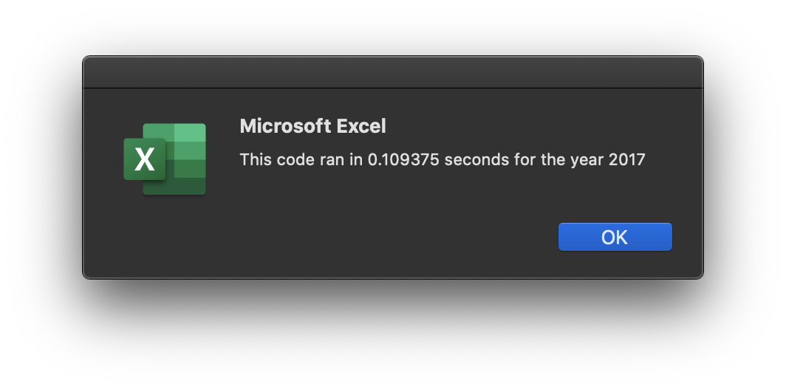
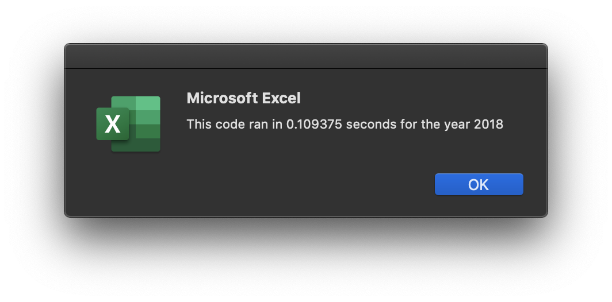

# VBA of Wall Street: Stock Analysis

## Overview of Project

### Purpose
The purpose of this project is to help Steve create a stock analysis tool that he can use to analyze stock performances and provide investment recommendations to his clients. To complete this task, I have analyzed sets of stock data for two different years using VBA code within the developer extension of Excel. Steve is now able to use the macros I wrote to run a stock analysis with the click of a button, and can then analyze the data to help his first client, his parents, make valuable and insightful investments.

## Results

### VBA Analysis
To perform this stock analysis, I used VBA in Excel to iterate through all the rows of the stock data, depending on the year specified by the user. To calculate total daily volume and return for each stock, I used for loops and conditionals (if/else statements) to get each total volume, starting price, and ending price. In the refactored code, this was done using different arrays where each stock had a corresponding index. The for loop used to do this analysis is shown below:  
    
    For i = 2 To RowCount

        tickerVolumes(tickerIndex) = tickerVolumes(tickerIndex) + Cells(i, 8).Value
        
        If Cells(i, 1).Value = tickers(tickerIndex) And Cells(i - 1, 1).Value <> tickers(tickerIndex) Then
        
            tickerStartingPrices(tickerIndex) = Cells(i, 6).Value

        End If
       
        If Cells(i, 1).Value = tickers(tickerIndex) And Cells(i + 1, 1).Value <> tickers(tickerIndex) Then
        
            tickerEndingPrices(tickerIndex) = Cells(i, 6).Value
            tickerIndex = tickerIndex + 1

        End If
    
    Next i

### Analyzing Stock Performance in 2017
In 2017, all analyzed stocks had positive returns except TERP, which had a return of -7.21%. The stocks that generated the highest returns this year were DQ, ENPH, and SEDG. The full analysis is shown below, visualizing the total daily volume and returns for each stock. 

### Analyzing Stock Performance in 2018
In 2018, most stocks in the analysis did not perform as well. Only ENPH and RUN generated positive returns, and the remainder of the stocks dropped dramatically. While DQ performed exceptionally well in 2017, fueling Steve's parents' initial investment decision, it plummeted in 2018 and would no longer be the best investment choice. The full results are shown below.

### Recommendation for Steve's Parents
Taking into account the stock returns for both 2017 and 2018, I would recommend Steve's parents diversify their investments and invest in both ENPH and RUN. While both stocks generated positive returns in both years, ENPH has decreased and RUN has increased. Therefore, I would recommend investing more in RUN than ENPH, but it is always a good idea to diversify their portfolio and not put all their money in one stock.

## Summary

### Refactoring Code in General
Refactoring code is advantageous when working with large data sets, as it helps to decrease runtime and increase efficiency. It also makes code more simplified and less repetitive, which is helpful for both the developer themself and anyone who may be reading or editing the code. Refactored code is easier to add to as well, as the code is more cohesive. While refactoring code has many advantages for all parties involved, it can be difficult and time consuming to do. If a developer is trying to find a solution to a problem, efficiency is usually not the first priority. It is easier to solve the problem first, making sure everything works correctly, before trying to refactor the solution, which would add a lot more time to the process. In some cases, it could be costly to refactor code as well.

### Refactoring the Stock Analysis VBA Script
In the case of this project, refactoring code had both advantages and disadvantages. First, it improved code efficiency and length, condensing several for loops into one that was able to complete all the tasks at hand. Second, it improved runtime of the program while still achieving the same accurate results. Because the datasets were on the smaller side, the difference is not as noticeable to user, as it is a fraction of a second with and without refactoring. I attached screenshots of the runtimes before and after refactoring the code.
Before: 
 

After:
 

Disadvantages to refactoring the code in this case include time consumption, and having to rewrite a lot of the code. I've coded using arrays several times, so I was able to understand what was going on, but for someone who has never coded before, trying to keep track of all 4 arrays at the same time could be extremely confusing. Additionally, refactoring the code took a lot of time, because I had to essentially rewrite the entire program. However, I believe the advantages outweigh the disadvantages and that refactoring code is definitely worth doing when possible. 
